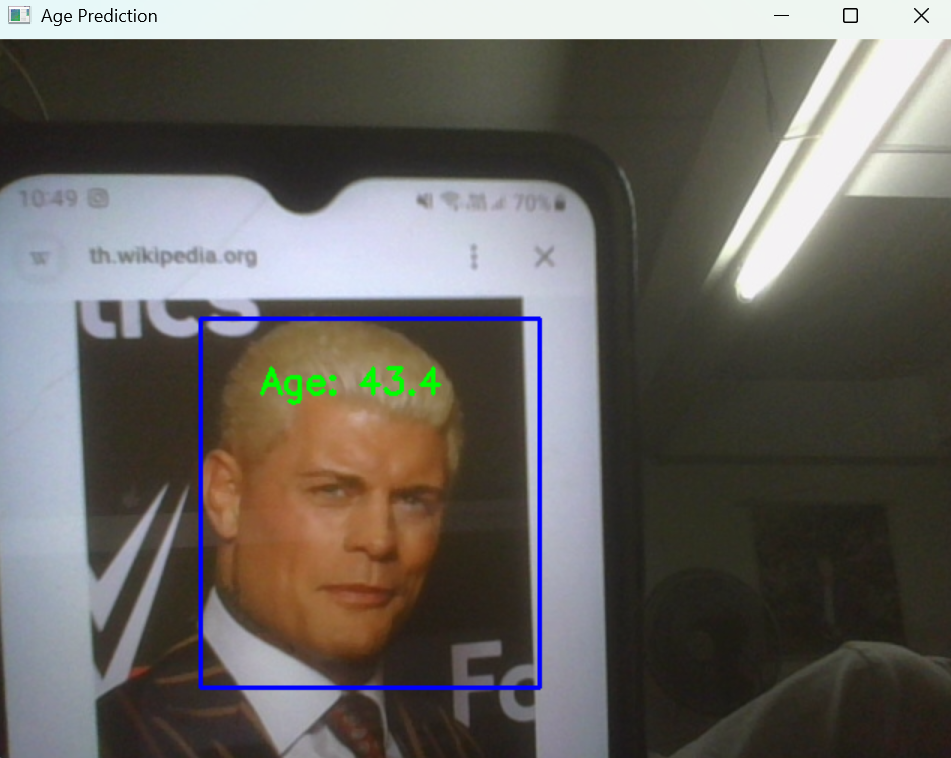
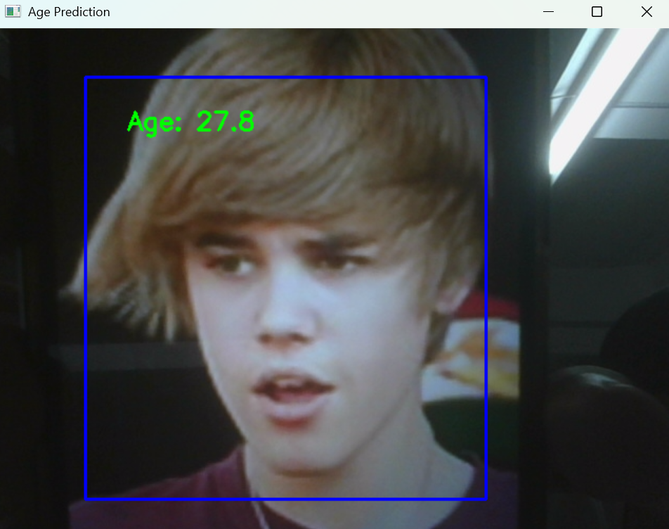
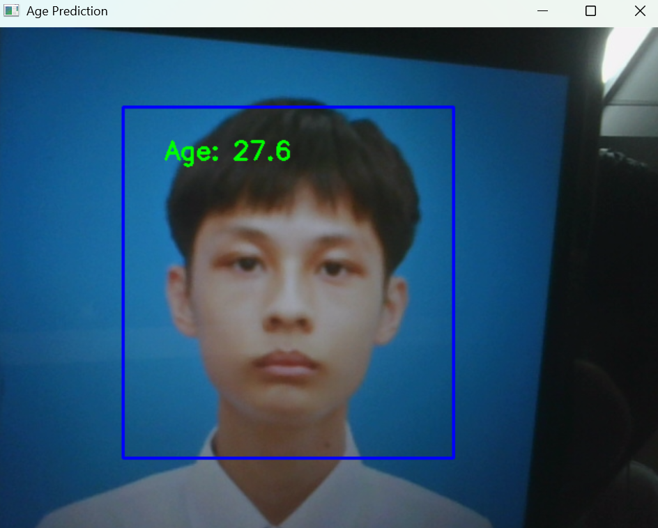
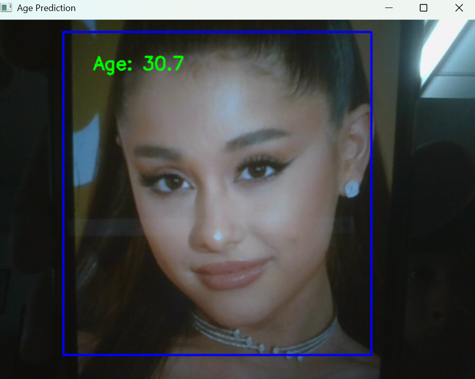
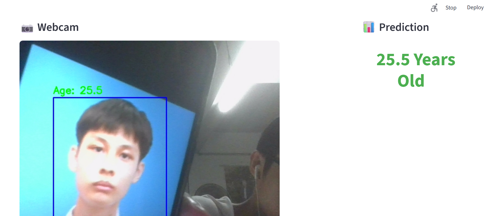
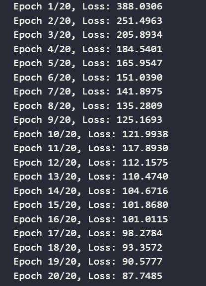
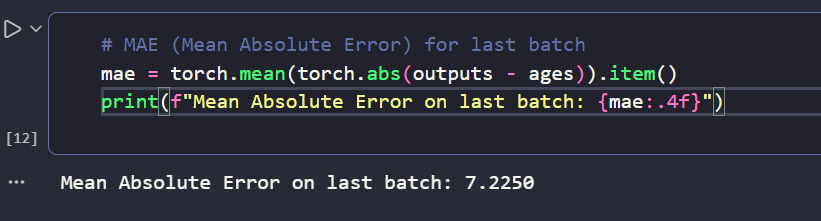

<div align="center">

# Age Prediction using Deep Learning with CNN-based Model and OpenCV

## <a href="https://saksit-age-prediction.streamlit.app/">🌐 Live Demo</a>


</div>

## 📋 About This Project

**THAI:** โปรเจคนี้เกี่ยวกับการใช้ Deep Learning ในการบอกอายุของคนแบบถ่ายรูป โดยใช้โมเดล CNN (Convolutional Neural Network) และ PyTorch ในการทำ Deep Learning โดยจะให้ Output เป็นแบบ Linear Regression ชุดข้อมูลมาจาก Kaggle ของ jangedoo (UTKFace) แอปพลิเคชันนี้จับวิดีโอจากเว็บแคม ตรวจจับใบหน้า และบอกอายุของใบหน้าที่ตรวจพบโดยใช้ CascadeClassifier (haarcascade_frontalface_default) OpenCV และแสดงผลลัพธ์โดยใช้ Streamlit ในการปรับใช้ในเว็บแอปพลิเคชัน

**ENG:** This project is about using deep learning to predict the age of people in pictures using a CNN (Convolutional Neural Network) and PyTorch. The output layer is a linear regression model. The dataset is from jangedoo's Kaggle (UTKFace). The application captures video from the webcam, detects faces, and predicts the age of the detected faces using CascadeClassifier (haarcascade_frontalface_default) from OpenCV, displaying the results using Streamlit to deploy the web application.

## ✨ Output Examples in Code

### Men Output

</img>
<br>

</img>
<br>

</img>
<br>

### Women Output

</img>
<br>

## ✨ Output Examples in Website
</img>
<br>

---

## 🛠️ Tool & Technologies

<ul>
<li>Python</li>
<li>Jupyter Notebook</li>
<li>PyTorch</li>
<li>OpenCV</li>
<li>CNN (Convolutional Neural Network)</li>
<li>Linear Regression</li>
<li>Streamlit</li>
</ul>

---

## 🔧 Requirement
You need to install theses libraries to run this project:
<ul>
<li>PyTorch</li>
<li>OpenCV</li>
<li>Streamlit</li>
</ul>

```cmd
pip install torch
pip install opencv-python
pip install streamlit
```

## 📈 Loss
The model achieved a loss of 87, reducing from 388 in 20 epochs. We can see that the model is learning and improving its predictions over time. The accuracy of the model is not directly measured in this case since it's a regression problem, but the decreasing loss indicates that the model is getting better at predicting ages. You can see that the Mean Absolute Error (MAE) for the last batch is around 7.2, which means that on average, the model's predictions are off by about 7.2 years from the actual ages in the last batch of data.

### Epoch Training Info
</img>

### MAE (Mean Absolute Error) for last batch
</img>

## 🚀 Getting Started

1. **Clone the repository**

```bash
git clone https://github.com/Saksit-Jittasopee/age-prediction-deep-learning.git
cd age-prediction-deep-learning
```

2. **Run**

<ul>
<li>click 'Run All' to execute all cells in the Jupyter Notebook</li>
</ul>

```cmd
run this file for webcam detection = age_prediction_webcam.ipynb
```

<ul>
<li>run this file to start website in your localhost</li>
</ul>

```cmd
python -m streamlit run age_prediction_app.py
```

---
## 📂 Dataset & Model
The dataset used in this project is the **UTKFace Dataset**, which contains images of faces with labels for age. The dataset is commonly used for training and evaluating models for age and gender classification tasks and also use in regression tasks for age prediction. It includes a diverse set of images with varying conditions, making it suitable for training robust models. The model used in this project is a CNN (Convolutional Neural Network) model for training using PyTorch. The face detection model we used is CascadeClassifier (haarcascade_frontalface_default) from OpenCV and is designed to detect faces in images.
<h3><a href="https://www.kaggle.com/datasets/jangedoo/utkface-new" target="_blank">Training Dataset</a>

<h3><a href="https://github.com/opencv/opencv/blob/4.x/data/haarcascades/haarcascade_frontalface_default.xml" target="_blank">OpenCV Haarcascades Frontalface Default</a></h3>

---

## 📄 License 

This project is open source and available under the [MIT License](LICENSE).

---

## 🤝 Connect With Me

<div align="center">

[](https://www.linkedin.com/in/saksit-jittasopee-743981382/)
[](https://github.com/Saksit-Jittasopee)
[](https://www.instagram.com/saksitjittasopee/)
[](https://x.com/theshockedxd)

**⭐ Star this repo if you like it!**

</div>

---

<div align="center">

Made with ❤️ by **Saksit Jittasopee**

_2nd Year DST Student @ Mahidol University_

</div>

